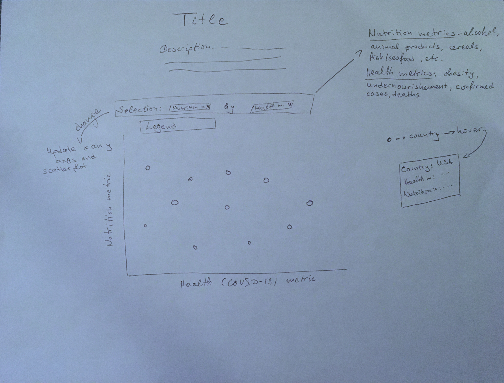
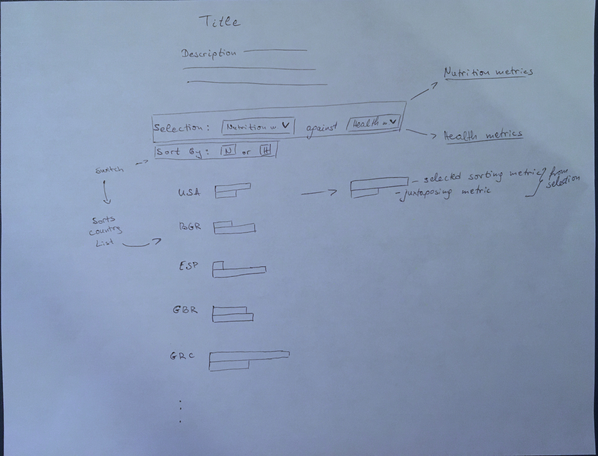
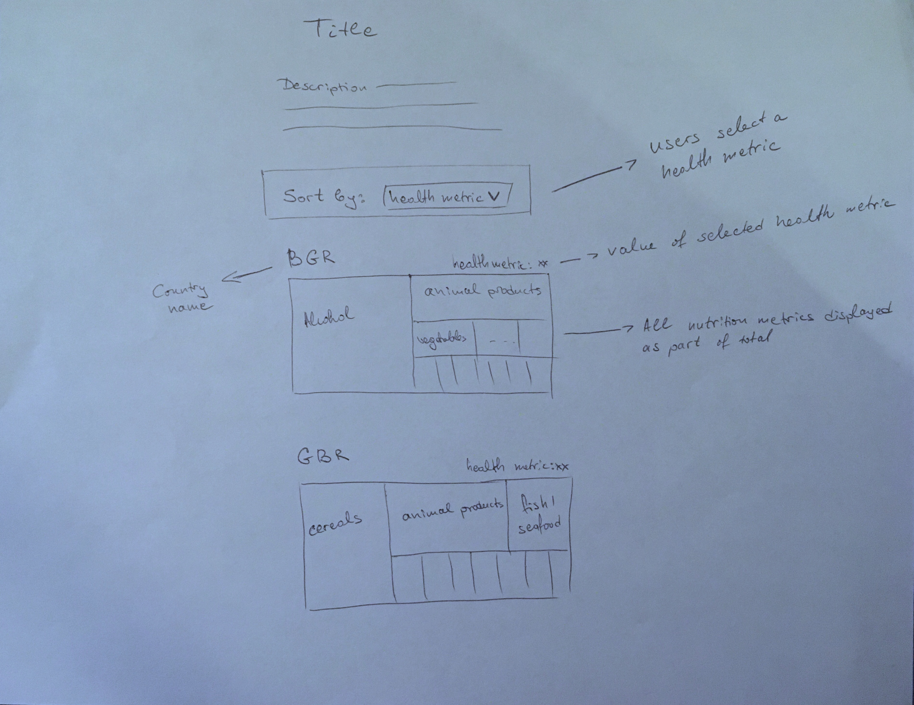

### Exercise 2: Form

*Give initial form to your concepts. This first prototype in a series of three iterations focuses on how your concept materializes.*

###### Audience
Users could explore the project when they are interested in learning more about the relationship between nutrition and health related metrics - obesity and undernourishment rate, COVID-19 cases and COVID-19 related deaths. Audience has some acquired knowledge on the topic of nutrition and how it is related to health, or they may specialize in the topic and have deeper knowledge about existing and potential correlations.

###### Data
	[
		{
			id: "",
			country_name: "",
			nutrition: {
				alcohol: Number,
				animal_fat: Number,
				vegetables: Number
				...	
			},
			health: {
				obesity: Number,
				undernourishment: Number,
				death_rate: Number,
				positivity_rate: Number
			},
			country_population: Number
		}
	]

###### Sketch # 1

Immediately after landing on the page, users will see the title and short description of the project. In addition, they will see a selection menu followed by the visualization and legend. Upon further engagement, users will see the correlations between the initially loaded in the selection menu nutrition and healt related measures, and their correlation in the visualization. Users will immediately see any correlations, and the more they engage with the visualization, the more information they will gather. The exploration of the scatter plot will include a hover, which reveals the countries with their name and exact values for both the selected health and nutrition metric. 

* Selection component: Users select two variables to juxtapose on the scatter plot: one nutrition metric and one health metric
* Data is displayed on a scatter plot, each circle indicating a country with its respective position on the X and Y axis
* Change of the selection triggers update of the scatter plot (axes and circle distribution)

Initially users have to select a nutrition metric and health metric. Next, when they interact with the visualization, they can hover over each circle to explore each country in more detail, and change their selection of metrics to update the visualization.

###### Sketch # 2

Immediately after landing on the page, users will see the title and short description of the project. In addition, they will see a selection menu followed by a sorting option, the visualization and legend. Upon further engagement with the project, they could select a nutrition and health metric form the selection menu, choose a sorting criteria out of the two, and explore the countries' data. In each separate visualization of a country, they will be able to explore information about the selected measures. The more users engage with the small multiples, the more comparisons they can make between countries based on the selected criteria.

* Selection component: Users select two variables to juxtapose on the small multiples
* Sorting component: Users choose how to sort the countries in the list based on the two criteria they selected
* Data is displayed as small multiples with one grouped bar chart (one bar for nutrition metric and one bar for health metric) per country
* Change of the selection triggers update of countries' ranks

Initially users have to select a nutrition metric and health metric. They can explore countries and make comparisons, and change their selection of metrics and sorting to update the visualization.

###### Sketch # 3

Immediately after landing on the page, users will see the title and short description of the project. In addition, they will see a sorting menu, allowing them to sort the visualizations by their desired health metric. Upon selection of health metric, users will see the nutritional data for each country. Each visualization will display the country name, value of the selected health metric and a distribution of all applicable nutrition metrics in a tree map.

* Selection component: Users select one health metric to sort the country list
* Nutrition metrics are displayed as small multiples with one tree map per country
* Change of the selection triggers update of countries' ranks

Initially users have to select a sorting health metric. Next, they can compare countries based on the shape of their data, see the values of each nutrition metric, and change the sorting criteria to update the visualizations.

