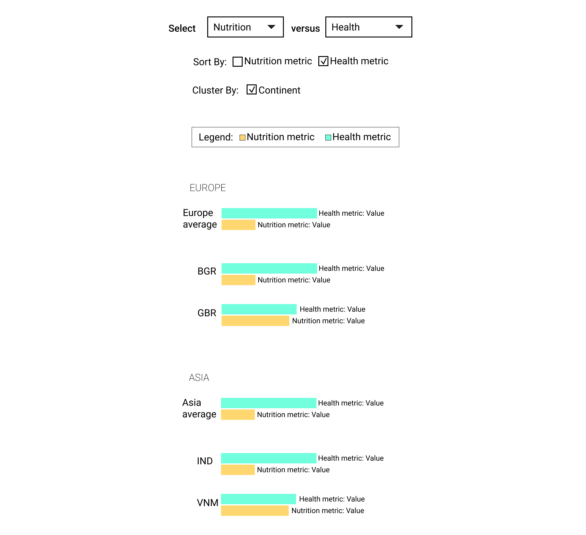

### Exercise 3: Prototyping

##### Visualization 1 - Small multiples - grouped bar
#####version 1

#####version 2

##### Visualization 2 - Scatterplot
#####version 1

#####version 2

##### Visualization 3 - Small multiples - treemap
#####version 1

#####version 2

